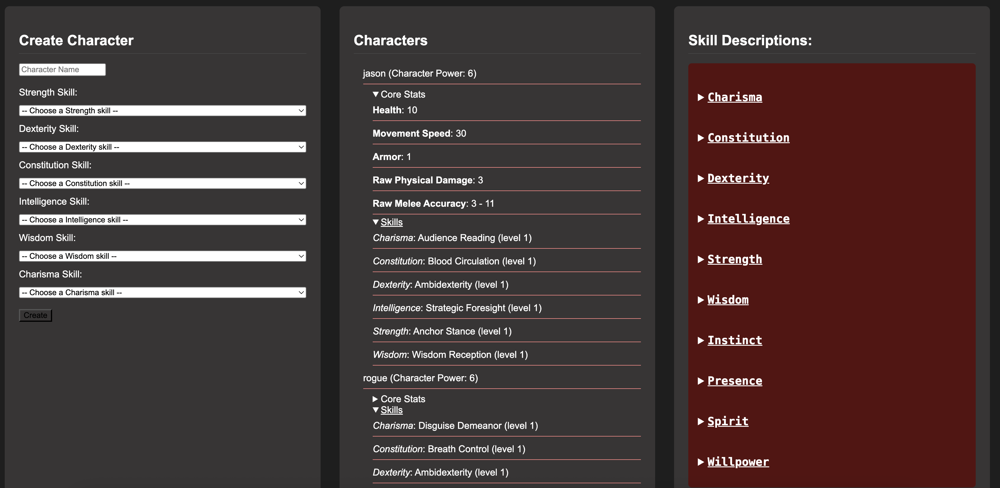
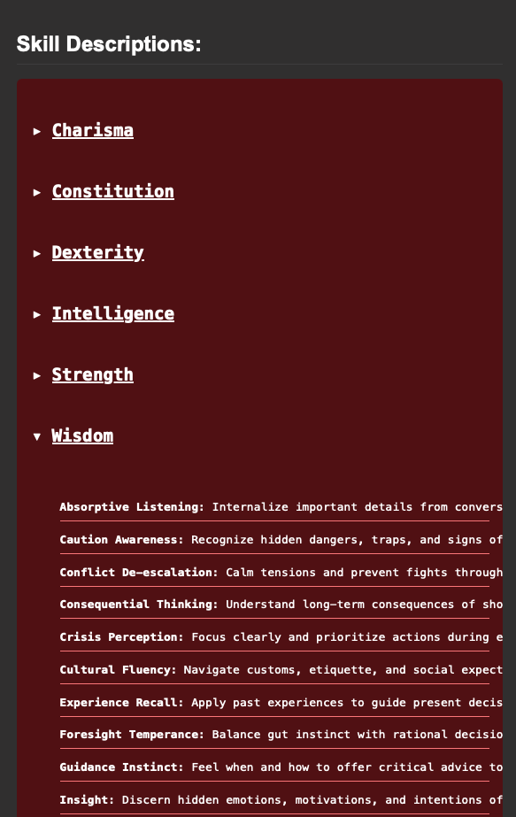
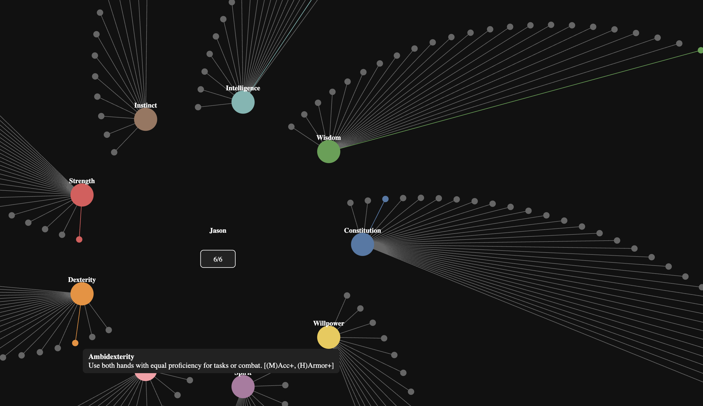
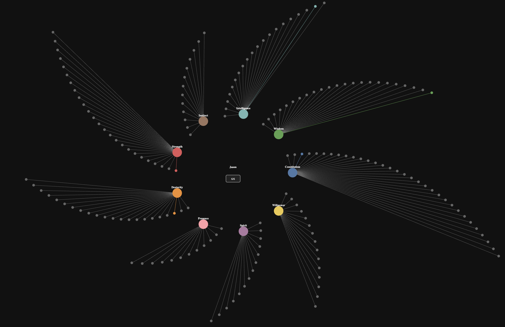
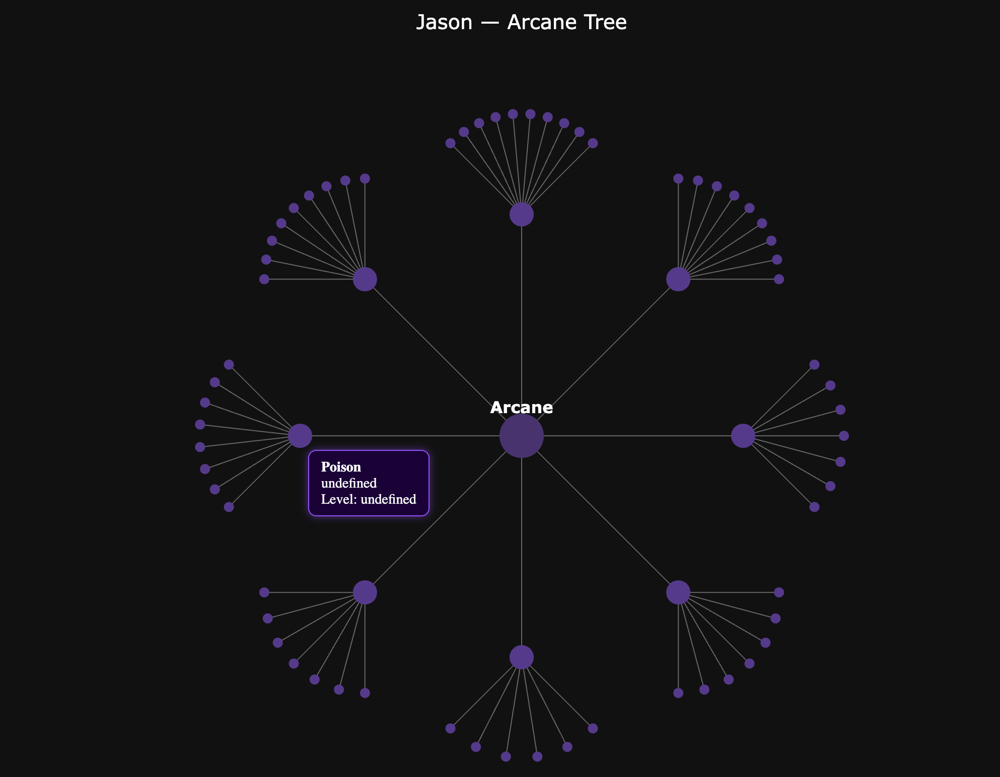
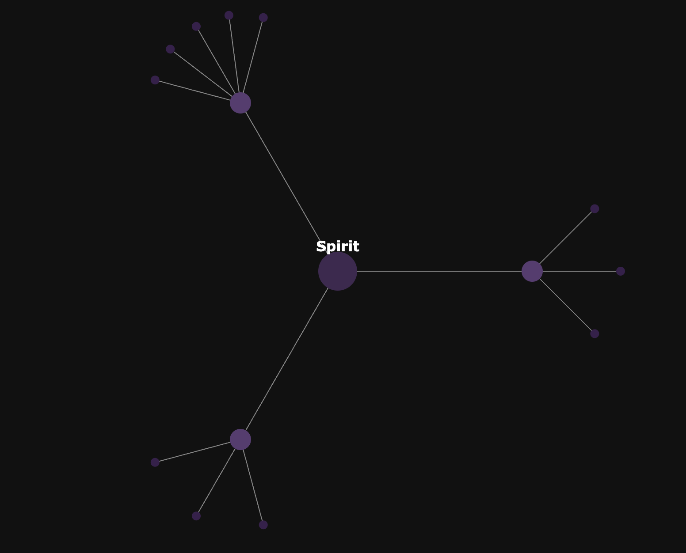
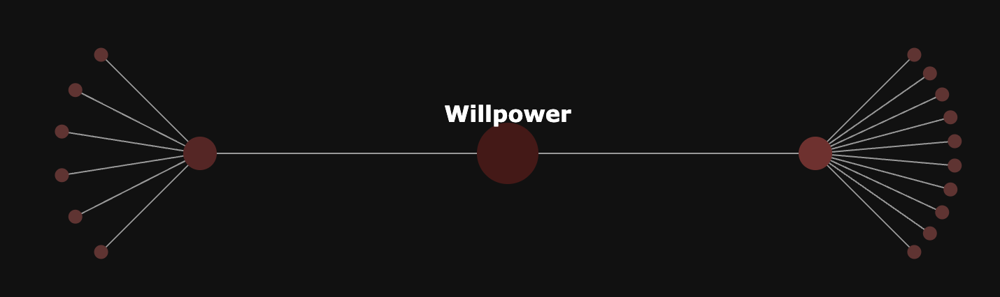
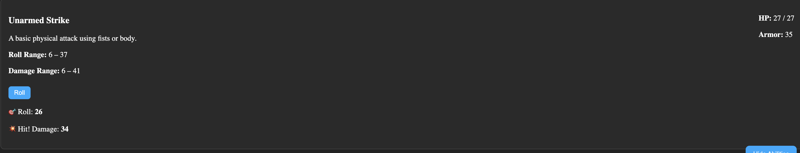

# Infinity Game Dashboard

The Infinity Game Dashboard is a modular character manager and stat visualizer built for deep skill-based RPG campaigns. It supports character creation, stat progression, and a dynamic radial skill tree that visually reflects chosen abilities in real time.

---

## 📌 Current System Design

Characters are stored in a centralized Firebase Realtime Database:

- All characters are saved under `characters/{name}`
- Each character tracks their primary/secondary stat values and individual skill levels
- A shared skill template is used to determine what skills exist and how they affect calculations

This centralized setup ensures fast querying, simple scaling, and a unified system for both character management and visualization.

---

## 💡 Feature Overview

### 1. 🎭 Character Creation

Characters are created by selecting one skill from each of the six primary stats: Strength, Dexterity, Constitution, Intelligence, Wisdom, and Charisma. These choices immediately affect their derived stats such as damage, armor, movement speed, and accuracy — calculated using formula functions in the backend.

---

### 2. 📚 Skill Template

The complete list of available skills is pulled from the static skill template stored in Firebase. Each stat section is collapsible and includes rich descriptions of what each skill does — including combat effects, passive bonuses, or defensive utility.

---

### 3. 🧙 Jason's Tree View

This is Jason's personal skill tree. You can see he selected **Ambidexterity**, a Dexterity skill that improves melee accuracy and provides an armor bonus. Only skills that the character has invested in are shown in full color — all others remain gray until selected.

---

### 4. 🌐 Full Skill Tree View

This is the complete, zoomed-out view of the skill tree. Each stat occupies a radial slice of the circle, and every available skill is pre-rendered in place. Stats are color-coded, but only selected skills receive their stat’s color — all others remain dimmed for clarity.

---

## 🛠 Technologies Used

- **Firebase Realtime Database** – Central data store for all characters and templates
- **D3.js** – SVG-based visualization for the radial skill tree
- **Vanilla JS + HTML/CSS** – No framework overhead
- **Vite** – Fast frontend bundler with native ESM and live reload

---

## 🚧 Future Plans

- Add interactive skill leveling in the tree view (per stat point)
- Filter or highlight skills by tag or effect (e.g. damage, armor, accuracy)
- Race/class-specific skillsets
- Exportable character sheets
- Admin-only edit mode for skill assignment

---

## Vision for the Future

Here we can see the same skill tree as before just zoomed out. This is how I envision every tree looking, like a galaxy of options. I plan to have at least 10 total.

---

## Mystical Skill Tree

Below are Jason’s current mystical arts trees. As you can see, they appear dull — that’s because none of these skill trees have been unlocked yet. These branches must be discovered through gameplay or granted as a privilege by the Dungeon Master or admin.

Arcane is already much more diverse than the others — and what you’re seeing is only `Tier 1`! Each mystical stat will eventually expand to include `4` full tiers, either as expanding rings or entirely new trees branching outward from the last tier.

---

## Drawers

A new addition to the project is the added feature of drawers, which will showcase all abilities, current health, armor class, and much more!

---