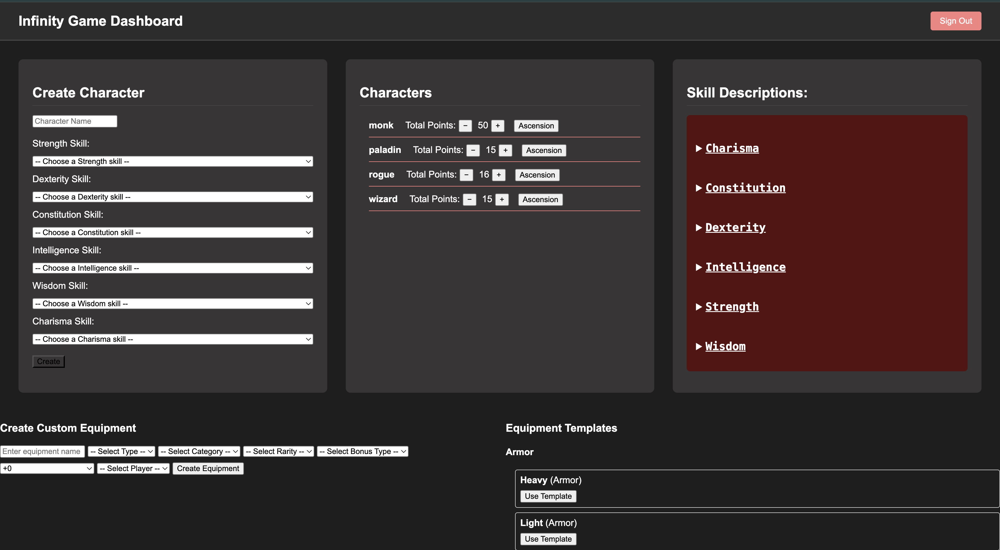
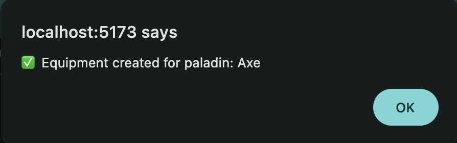
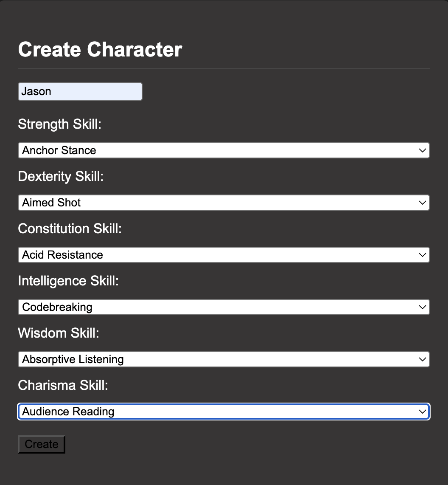
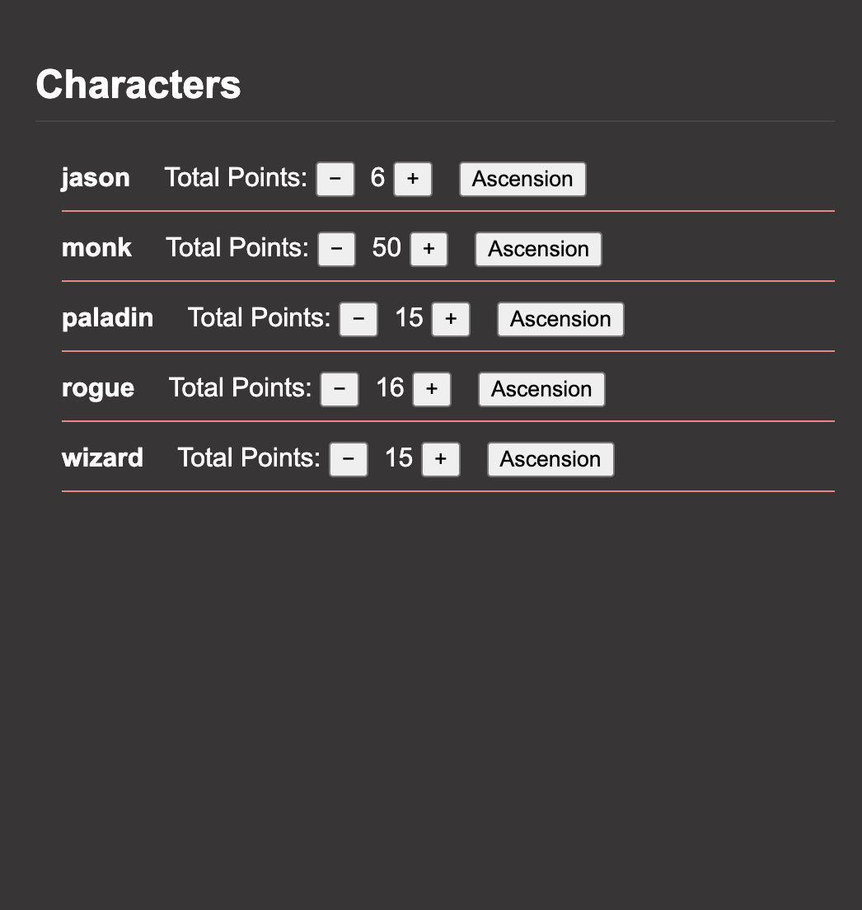
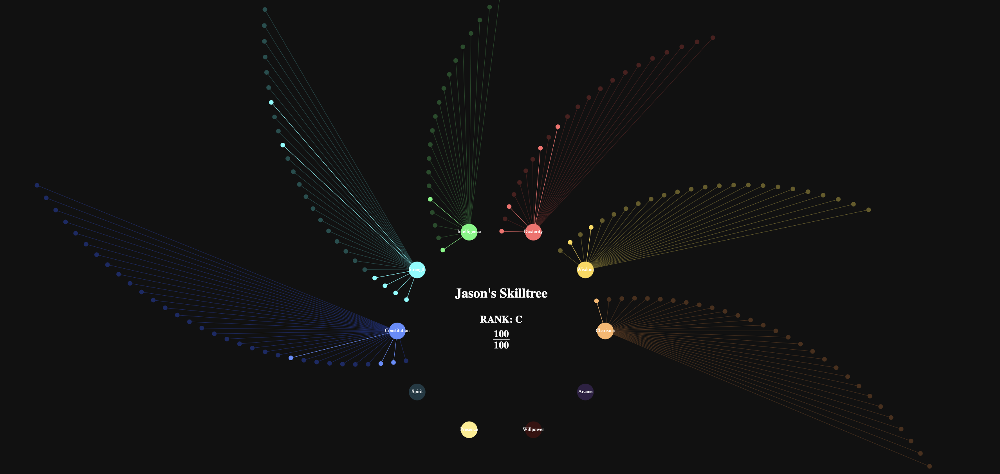
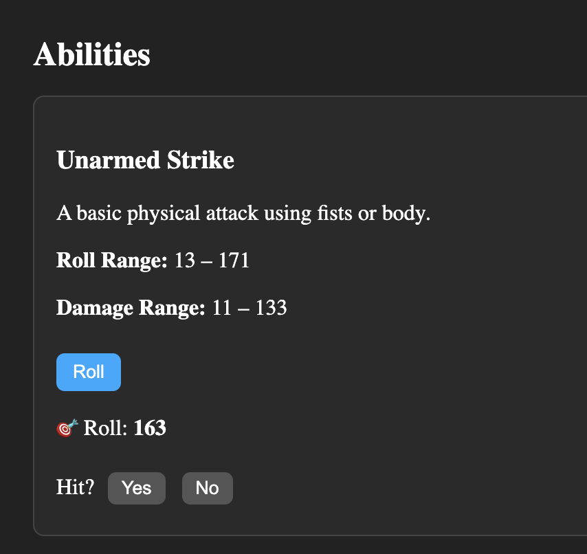
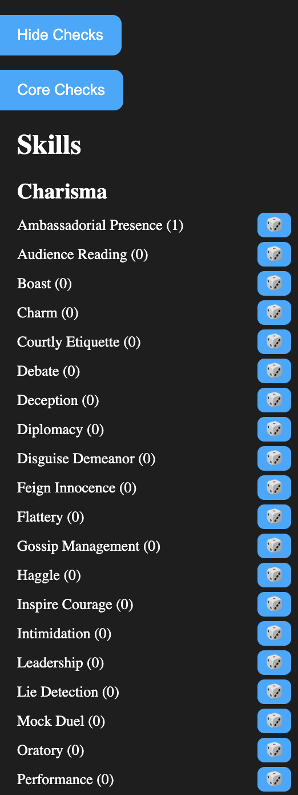
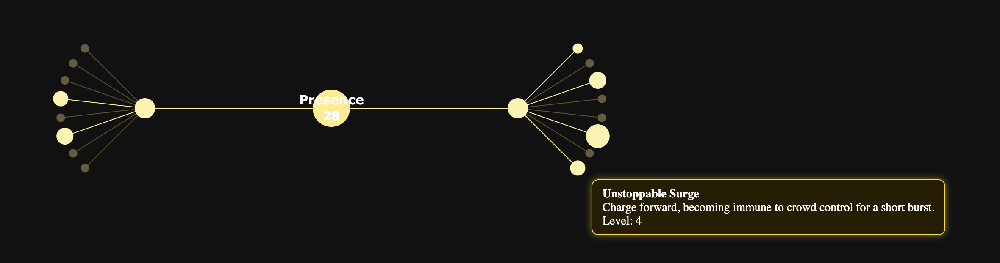

# Infinity Game Dashboard

The Infinity Game Dashboard is a modular character manager and stat visualizer built for deep skill-based RPG campaigns. It supports character creation, stat progression, and a dynamic radial skill tree that visually reflects chosen abilities in real time.

## 🎲 Dungeon Master's Interface

The dashboard provides comprehensive tools for Dungeon Masters to manage their campaign and characters.


*The Dungeon Master's main interface provides quick access to equipment creation, character management, and progression controls. DMs can increase player levels and grant ascension directly from this screen.*

### Equipment Management
Creating and managing equipment is straightforward through the intuitive interface:


*The equipment creation interface allows detailed weapon and armor customization with real-time stat visualization.*

## 🎭 Character Journey

### Character Creation
The journey begins with character creation:


*Following Jason's journey: Here we see his initial creation in the system, setting the foundation for his adventures.*

### Party Management
Characters don't exist in isolation - they're part of a living world:


*The party management screen shows Jason alongside other characters created by the Dungeon Master, facilitating group dynamics and interactions.*

## 📊 Character Development

### Skill Tree System
The heart of character progression is the dynamic skill tree:


*Jason's skill tree visualizes his attribute distribution and progression paths. The radial design provides an intuitive view of character development.*

### Combat Capabilities
Character skills directly influence their combat effectiveness:


*Combat interface showing Jason's chance to hit and potential damage output, dynamically calculated from his skills and attributes.*

### Skill Proficiencies
Beyond combat, characters develop various skills and abilities:


*A comprehensive view of Jason's skill check modifiers, reflecting his training and natural aptitudes.*

### Mystical Arts
Some characters develop supernatural abilities:


*Jason's Presence tree showcases his mystical capabilities, representing supernatural influence and control.*

---

## 📌 System Architecture

The application is structured as follows:

- **Frontend**: A modern web application built with vanilla JavaScript
- **Backend**: Node.js server with Firebase integration
- **Database**: Firebase Realtime Database for character and game data storage
- **Character System**: Modular system for managing character stats, skills, and equipment
- **Skill Trees**: Multiple specialized skill trees including base attributes and mystical arts

---

## 🗂 Project Structure

```
infinity_game/
├── frontend/           # Main web application
│   ├── equipment/      # Equipment management
│   ├── skilltree/     # Skill tree visualization
│   ├── mystical/      # Mystical arts system
│   └── scripts/       # Core game logic
├── firebase/          # Firebase configuration
├── system_database/   # Game system data
└── character/         # Character management
```

---

## 💡 Core Features

### 1. 🎭 Character Management
- Comprehensive character creation and progression
- Equipment and inventory system
- Stat tracking and calculations
- Multiple skill tree support

### 2. 🌟 Skill Trees
- Base attribute trees (Strength, Dexterity, Constitution, etc.)
- Mystical arts trees (Arcane, Presence, Spirit, Willpower)
- Visual progression tracking
- Multi-tier skill system

### 3. 🛡 Equipment System
- Detailed equipment management
- Stats and bonuses calculation
- Equipment effects on character abilities

### 4. 🎲 Game Systems
- Dynamic stat calculations
- Skill interaction systems
- Character progression tracking
- Admin controls for game management

---

## 🛠 Technologies

- **Frontend**: 
  - Vanilla JavaScript
  - HTML5/CSS3
  - Vite for development and building
- **Backend**:
  - Node.js
  - Firebase Admin SDK
- **Database**:
  - Firebase Realtime Database
- **Development**:
  - Git for version control
  - Modern ES6+ JavaScript

---

## 🎮 Features in Development

- Enhanced character progression systems
- Advanced equipment management
- Expanded mystical arts trees
- Improved UI/UX for skill tree navigation
- Additional admin tools and controls

---

## 🔮 Mystical Arts System

The mystical arts system features multiple specialized trees:

- **Arcane**: Advanced magical abilities and spells
- **Presence**: Character influence and control
- **Spirit**: Spiritual and ethereal powers
- **Willpower**: Mental fortitude and resistance

Each tree contains multiple tiers of progression, offering deep character customization and development paths.

---

## 📱 Interface Features

The dashboard includes various UI components for easy character management:

- Collapsible drawers for detailed information
- Real-time stat updates
- Visual skill tree navigation
- Equipment management interface
- Character status displays

---

For more information about specific features or contributing to the project, please check the documentation in the respective directories.