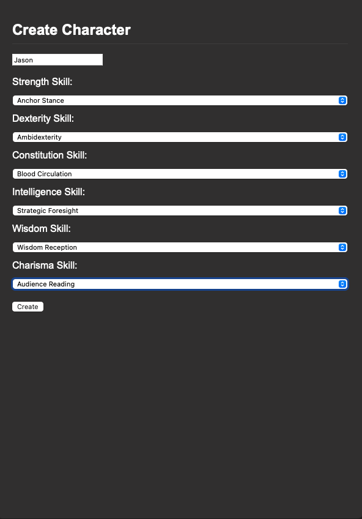
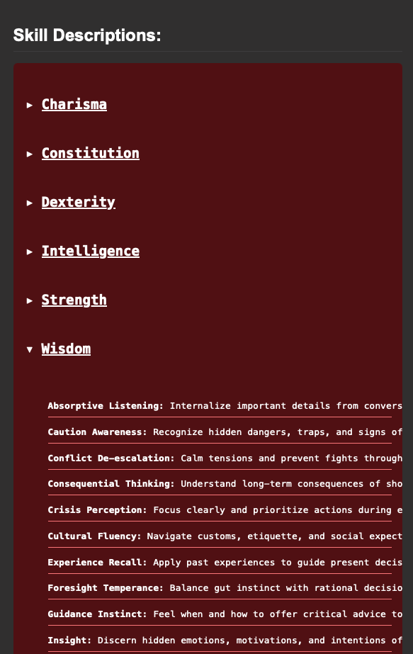
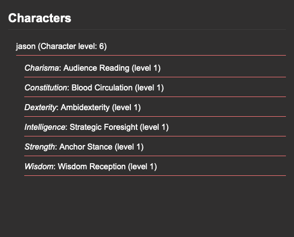

# Infinity Game Dashboard

The Infinity Game Dashboard is a custom character manager designed for tabletop RPG campaigns with deep skill-based progression. This interface allows a Game Master to create characters, assign them starting skills, and track their growth over time — all connected to a central Firebase backend.

---

## 📌 Current System Design

Originally, each character was intended to have their own individual Firebase database. However, through iteration we realized this approach introduced unnecessary complexity and overhead. We have now transitioned to a **single shared database**, where:

- All characters are stored under one path (`characters/{name}`)
- Each character has their own skill allocations and stat values
- The dashboard pulls everything from this centralized structure

This makes the system easier to scale, faster to query, and much more efficient to maintain.

---

## 💡 Dashboard Features

### 🔧 Create Characters

Characters can be created by choosing one skill from each of the six primary ability scores: Strength, Dexterity, Constitution, Intelligence, Wisdom, and Charisma. Each selected skill is initialized at level 0.

---

### 📖 Skill Descriptions

The skill template is automatically pulled from Firebase and shown in a scrollable, collapsible format. Each stat displays its available skills and their descriptions.

---

### 🧙 Character Overview

Each character displays:
- Their name
- The total number of skill points they've allocated (in parentheses)
- A collapsible list of the skills they've selected and their current levels

This streamlined format allows for quick GM reference without clutter.

---

## 🛠 Technologies Used

- **Firebase Realtime Database** for centralized data
- **Vanilla JavaScript** for frontend logic
- **HTML/CSS** for structure and layout
- Lightweight design for fast load and portability

---

## 🚧 Future Plans

- Add skill upgrading functionality per stat point
- Visualize skill trees by core stat
- Add support for race/class-specific skills
- Printable/exportable character sheets

---

## 📁 Folder Structure

- `backend/`  
  Contains abbreviation mappings and visible stat functions used to calculate accuracy, damage, and other formulas.

- `character/`  
  Backup scripts for creating, deleting, and displaying characters. No longer part of the main workflow but kept for reference.

- `firebase/`  
  Includes `push_template.js` and `pull_template.js` — tools to log or update the static skill template.  
  Also includes `firebaseKey.json` for Firebase authentication credentials.

- `frontend/`  
  Contains `index.html` and `app.js`, which power the main dashboard interface and logic for character creation and display.

- `images/`  
  Screenshots used for README documentation and interface previews.

- `system_database/skills/`  
  Original Python-based skill tables for each stat. These will eventually be migrated to JavaScript to unify the stack.

