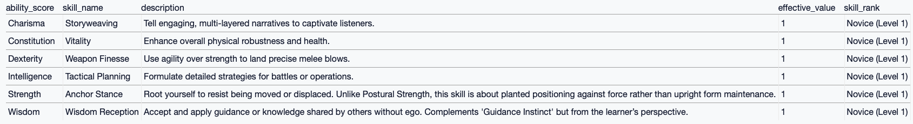
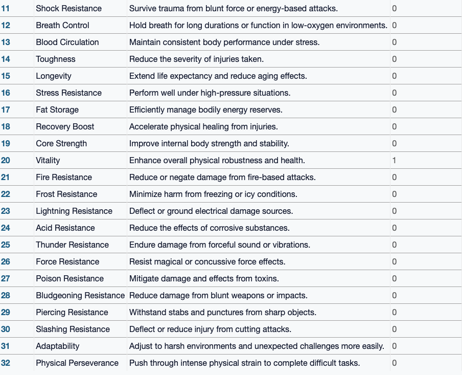
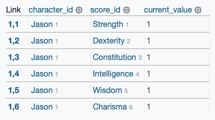
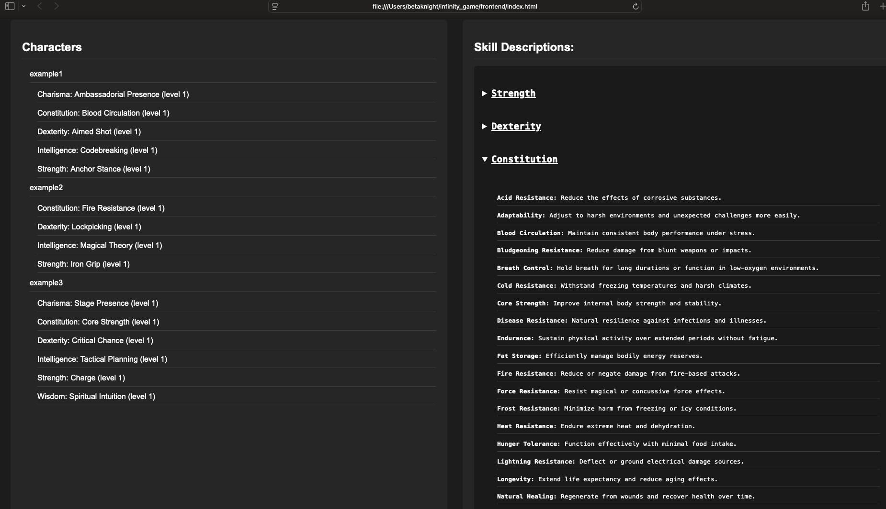

# Infinity Game Character System

The Infinity Game character system is a dynamic framework for building customizable RPG characters based on a deep skill tree structure. This system originally created a separate SQLite database for each character, but has evolved to a centralized real-time database approach powered by Firebase, providing a faster, cleaner, and more scalable solution.

## 🔧 System Overview

This project is powered by a hybrid **Python + JavaScript** backend. Originally, Python handled database creation and schema design locally, while JavaScript enabled dynamic character interaction, skill point allocation, and database updates.

**Current Architecture** (Post-Upgrade):
- Firebase Realtime Database acts as the global character skill template
- Each character references the master skill tree but stores only their unique selections
- Characters are stored by name under `characters/`
- Skills are selected individually during character creation

Each character is created using a prompt and automatically receives:

- **All primary stats** set to 1: Strength, Dexterity, Constitution, Intelligence, Wisdom, Charisma
- **All secondary stats** set to 0: Instinct, Presence, Spirit, Willpower
- **Ability to choose 1 skill per primary stat** at level 0
- **Option to skip** skills and allocate later

## ✨ New Architecture Motivation

Originally, every character had their own database file (`{first_name}_infinity.db`). While this was useful locally, it made online play and tracking multiple players difficult to scale.

With **Firebase Realtime Database**:
- Characters are lightweight
- Skill templates are universal and easy to update
- Multi-user expansion becomes possible
- Easier integration into a web dashboard (browser view)

## 👤 Example Character: Jason

Upon creating Jason, the user was guided through a prompt that let them choose one skill for each of the six primary stats.

### Jason's Skill Choices

Here’s a view of the skills Jason selected during creation:

Each selected skill starts at **level 1** (`effective_value = 1`).

### Constitution Skill Tree Example

During the constitution selection, Jason chose "Vitality". Here’s a snapshot of other constitution-based options Jason could have selected:

Every skill is rich with passive bonuses or resistances that feed into character growth.

### Jason's Current Profile

Once created, Jason’s stats and skills are visible and managed through the database:

The system can later allow skill improvements, new unlocks, and skill dependencies as gameplay progresses.

## 🌐 Live Character Dashboard

We also created a basic web dashboard that pulls real-time updates from Firebase.

- Click on a character's name to expand their skill selections
- Only stats where points were allocated are shown
- Clean organization between primary and secondary scores

This structure mirrors how players will view their progress dynamically during gameplay.

## ⚙️ Technical Features

- Centralized Firebase Realtime Database
- Dynamic skill point allocation
- Modular expandable skill trees
- Placeholder `effective_value` system for future progression
- Admin-controlled character creation and updates
- Web-based frontend viewer (HTML/CSS/JavaScript)

---

This repository will continue evolving with:

- Race and Class additions
- Passive stat bonuses based on world events
- Character progression trees
- DM tools for creating **new skills** and **modifiers**
- Full exportable character sheets (Markdown / PDF)

The journey from a local SQLite architecture to a fully online real-time database system shows how **Infinity Game** continues to grow toward a scalable, dynamic RPG platform.
